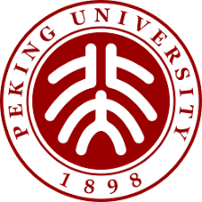

## About Me

Wonduk Seo is an AI Research Scientist at <a class="about-link" href="https://www.enhans.ai/" target="_blank">Enhans AI</a> since January 2025 and a 2025 graduate of Peking University (Bachelor in Information Management, Big Data Management &amp; Application). Previously, he was advised by <a class="about-link" href="https://scholar.google.com/citations?user=bSUm6ikAAAAJ&amp;hl=en" target="_blank">Prof. Yi Bu</a> at Peking University. His research focuses on scalable, transparent, and interpretable methods that keep LLMs grounded in human values, sustain behavioral consistency, and mitigate hallucinations in real-world deployments. He has published <strong>first-author papers</strong> at top AI venues such as ICML, ACL, WSDM, SIGIR-ICTIR, ICPR, and BigData.

  
<i class="fa-solid fa-graduation-cap" aria-hidden="true"></i>Education

  

    
    

      

        <strong>Peking University</strong>
        Sep. 2019 - Jun. 2025
      

      
<i class="fa-solid fa-location-dot" aria-hidden="true"></i>Beijing, China

      
Bachelor in Information Management

      
Advisor: Prof. Yi Bu

    

  

***

## Research Interests

<ul class="research-interest-list">
  <li>
    
<strong class="research-interest-lead">Socially Responsible, Interpretable, and Aligned AI:</strong> Advancing interpretability and accuracy in LLMs through transparent evaluation, retrieval-augmented reasoning, and feedback loop to ensure socially beneficial and context-aware behavior.

    

      <a class="research-pub-chip" href="https://arxiv.org/abs/2601.21700" target="_blank" rel="noopener noreferrer">Seo et al., ICML'26</a>
      <a class="research-pub-chip" href="https://ojs.aaai.org/index.php/AIES/article/view/36717" target="_blank" rel="noopener noreferrer">Seo et al., AAAI-AIES'25</a>
    

  </li>
  <li>
    
<strong class="research-interest-lead">Multi-Agent Reasoning and Interaction:</strong> Developing collaborative agent architectures that support reasoning, prompt optimization, and hallucination reduction while enabling interpretable decision-making at scale.

    

      <a class="research-pub-chip" href="https://arxiv.org/abs/2503.23314" target="_blank" rel="noopener noreferrer">Seo et al., ACL'26</a>
      <a class="research-pub-chip" href="https://arxiv.org/abs/2502.11140" target="_blank" rel="noopener noreferrer">Seo et al., ICPR'26</a>
    

  </li>
  <li>
    
<strong class="research-interest-lead">Information Retrieval with LLMs:</strong> Designing adaptive query reformulation and expansion pipelines that capture nuanced intent and orchestrate multiple retrieval strategies for precise, transparent access to information.

    

      <a class="research-pub-chip" href="https://dl.acm.org/doi/10.1145/3773966.3779360" target="_blank" rel="noopener noreferrer">Seo et al., WSDM'26</a>
      <a class="research-pub-chip" href="https://arxiv.org/abs/2604.17301" target="_blank" rel="noopener noreferrer">Lee* and Seo* et al., SIGIR-ICTIR'26</a>
      <a class="research-pub-chip" href="https://arxiv.org/abs/2509.01182" target="_blank" rel="noopener noreferrer">Seo et al., BigData'25</a>
    

  </li>
  <li>
    
<strong class="research-interest-lead">Evidence Inheritance in LLM Pipelines:</strong> Developing methods to track how external evidence is inherited, transformed, and selectively used across multi-stage LLM systems, so that provenance remains interpretable and trustworthy, and integrating LLM post-training to improve evidence grounding, calibration, and traceable reasoning.

    

      <a class="research-pub-chip" href="https://arxiv.org/abs/2604.23993" target="_blank" rel="noopener noreferrer">Seo†, AAAI-Symposium'26</a>
      <a class="research-pub-chip" href="https://direct.mit.edu/qss/article/doi/10.1162/qss_a_00360/128587/Transforming-Role-Classification-in-Scientific" target="_blank" rel="noopener noreferrer">Seo et al., Quantitative Science Studies</a>
    

  </li>
</ul>

***

## News

<ul>
  <li><strong>[Jul. 2026]</strong> Concluded my role as an AI Researcher at <a class="about-link" href="https://www.enhans.ai/" target="_blank">Enhans AI</a>.</li>
  <li><strong>[Jun. 2026]</strong> One <strong>co-first author</strong> paper got accepted to the <strong>International ACM SIGIR Conference on Innovative Concepts and Theories in Information Retrieval (ICTIR)</strong> for Oral Presentation 🇦🇺.</li>
  <li><strong>[May 2026]</strong> One <strong>first author</strong> paper got accepted to the <strong>Forty-Third International Conference on Machine Learning (ICML)</strong> 🇰🇷.</li>
  <li><strong>[May 2026]</strong> One <strong>corresponding author</strong> abstract paper got accepted to the <strong>AAAI Summer Symposium Series</strong> for Oral Presentation 🇰🇷.</li>
  <li><strong>[Apr. 2026]</strong> One <strong>co-first author</strong> paper got accepted to the <strong>Annual Meeting of the Association for Computational Linguistics (ACL) 2026 Main Conference</strong> 🇺🇸.</li>
  <li><strong>[Apr. 2026]</strong> One <strong>first author</strong> paper got accepted to <strong>International Conference on Pattern Recognition (ICPR)</strong> 🇫🇷.</li>
  <li><strong>[Dec. 2025]</strong> One <strong>first author</strong> paper got accepted to <strong>ACM International Conference on Web Search and Data Mining (WSDM)</strong> 🇺🇸!</li>
  <li><strong>[Nov. 2025]</strong> One <strong>co-first author</strong> paper got accepted to <strong>ACM/IEEE Joint Conference on Digital Libraries (JCDL)</strong> 💻.</li>
  <li><strong>[Oct. 2025]</strong> One <strong>co-first author</strong> paper got accepted to <strong>IEEE International Conference on Big Data 2025 Industry Track</strong> for Oral Presentation 🇲🇴.</li>
  <li><strong>[Jul. 2025]</strong> One <strong>first author</strong> paper got accepted to <strong>AAAI/ACM Conference on AI, Ethics, and Society (AIES) Main Track</strong> 🇪🇸.</li>
  <li><strong>[Jul. 2025]</strong> <mark><strong>Graduated from Peking University</strong></mark> (Bachelor in Information Management, Big Data Management &amp; Application) 🎉!</li>
  <li><strong>[Jun. 2025]</strong> One <strong>first author</strong> paper accepted for Oral Presentation at the <strong>ACM SIGKDD 2025 Workshop on AI Agent for Information Retrieval</strong> 🇨🇦.</li>
  <li><strong>[Apr. 2025]</strong> One <strong>co-first author</strong> paper got accepted to <strong>IEEE Engineering in Medicine and Biology Society (EMBC)</strong> for Oral Presentation 🇩🇰.</li>
  <li><strong>[Apr. 2025]</strong> Gave a poster talk at the <strong>International Conference on Research in Computational Molecular Biology (RECOMB)</strong> 🇰🇷.</li>
  <li><strong>[Feb. 2025]</strong> One <strong>first author</strong> paper accepted by <strong>Quantitative Science Studies (QSS)</strong>.</li>
  <li><strong>[Jan. 2025]</strong> Concluded my role as an LLM researcher at <a class="about-link" href="https://www.baidu.com/" target="_blank">Baidu Inc.</a>.</li>
  <li><strong>[Jan. 2025]</strong> Rejoined <a class="about-link" href="https://www.enhans.ai/" target="_blank">Enhans AI</a> as an AI Research Scientist.</li>
  <li><strong>[Nov. 2024]</strong> Ranked 9th in the ACM'24 FinanceRAG Challenge as Team Leader.</li>
  <li><strong>[May. 2024]</strong> 🥉 Earned a bronze medal in Kaggle’s Enefit Predict Energy Behavior of Prosumers (Solo).</li>
  <li><strong>[Apr. 2024]</strong> 🥉 Earned a bronze medal in Kaggle’s Harvard Medical School Brain Activity Classification (Team Leader).</li>
  <li><strong>[Feb. 2024]</strong> Wrapped up my role as a Machine Learning Engineer at <a class="about-link" href="https://www.enhans.ai/" target="_blank">Enhans AI</a> to pursue research-focused opportunities.</li>
  <li><strong>[Dec. 2023]</strong> 🥈 Earned a silver medal in Kaggle’s CAFA 5 Protein Function Prediction (Solo).</li>
  <li><strong>[Oct. 2023]</strong> 🥉 Earned a bronze medal in Kaggle’s LLM Science Exam (Team).</li>
  <li><strong>[Aug. 2023]</strong> Completed my Data Scientist internship at <a class="about-link" href="https://www.lgchem.com/main/index" target="_blank">LG Chem</a>.</li>
  <li><strong>[Apr. 2023]</strong> Completed a Data Scientist internship at <a class="about-link" href="https://www.linkedin.com/company/betabrainco/" target="_blank">BetaBrain</a>.</li>
  <li><strong>[Apr. 2022]</strong> Began a long-term collaboration with <a class="about-link" href="https://scholar.google.com/citations?user=bSUm6ikAAAAJ&hl=en" target="_blank">Prof. Yi Bu</a>.</li>
  <li><strong>[Dec. 2020]</strong> Began my AI journey, diving into machine learning research and engineering.</li>
</ul>

***





  

