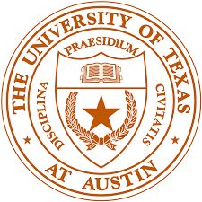

## About Me

I'm an incoming PhD student in Computer Science at University College London, working with Prof. Emine Yilmaz. I study how language models reason, use evidence, and stay aligned with human values. Previously, I studied at Peking University, advised by Prof. Yi Bu. My first-author work has appeared at ICML, ACL, WSDM, SIGIR-ICTIR, ICPR, and BigData.

  <h3 class="education-card-heading" id="education">Education</h3>
  

    
    

      

        

          <strong>University College London</strong>
          
<i class="fa-solid fa-location-dot" aria-hidden="true"></i>London, United Kingdom

        

        Oct. 2026 - Present
      

      
PhD in Computer Science

      
Advisor: Prof. Emine Yilmaz

      
<i class="fa-solid fa-award" aria-hidden="true"></i>Four-year fully funded PhD scholarship

    

  

  

    
    

      

        

          <strong>Peking University</strong>
          
<i class="fa-solid fa-location-dot" aria-hidden="true"></i>Beijing, China

        

        Sep. 2019 - Jun. 2025
      

      
Bachelor in Information Management

      
Big Data Management &amp; Application

      
Advisor: Prof. Yi Bu

    

  

***

## Research Interests

<ul class="research-interest-list">
  <li>
    
<strong class="research-interest-lead">Alignment &amp; interpretability</strong> Evaluating and aligning language models with human values through transparent reasoning and feedback.

    

      <a class="research-pub-chip" href="https://openreview.net/pdf?id=hhpU1JMhKR" target="_blank" rel="noopener noreferrer">Seo et al., ICML'26</a>
      <a class="research-pub-chip" href="https://ojs.aaai.org/index.php/AIES/article/view/36717" target="_blank" rel="noopener noreferrer">Seo et al., AAAI-AIES'25</a>
    

  </li>
  <li>
    
<strong class="research-interest-lead">Multi-agent reasoning</strong> Building agent systems that reason together, optimize prompts, and reduce hallucinations.

    

      <a class="research-pub-chip" href="https://arxiv.org/abs/2503.23314" target="_blank" rel="noopener noreferrer">Seo et al., ACL'26</a>
      <a class="research-pub-chip" href="https://arxiv.org/abs/2502.11140" target="_blank" rel="noopener noreferrer">Seo et al., ICPR'26</a>
    

  </li>
  <li>
    
<strong class="research-interest-lead">Information retrieval</strong> Enhancing information retrieval through query reformulation, retrieval fusion, and model training.

    

      <a class="research-pub-chip" href="https://dl.acm.org/doi/10.1145/3773966.3779360" target="_blank" rel="noopener noreferrer">Seo et al., WSDM'26</a>
      <a class="research-pub-chip" href="https://dl.acm.org/doi/10.1145/3805713.3820397" target="_blank" rel="noopener noreferrer">Lee* and Seo* et al., SIGIR-ICTIR'26</a>
      <a class="research-pub-chip" href="https://arxiv.org/abs/2509.01182" target="_blank" rel="noopener noreferrer">Seo et al., BigData'25</a>
    

  </li>
  <li>
    
<strong class="research-interest-lead">Evidence in LLM pipelines</strong> Tracing how evidence is used across multi-stage systems, with post-training for better grounding and calibration.

    

      <a class="research-pub-chip" href="https://arxiv.org/abs/2604.23993" target="_blank" rel="noopener noreferrer">Seo†, AAAI-Symposium'26</a>
      <a class="research-pub-chip" href="https://direct.mit.edu/qss/article/doi/10.1162/qss_a_00360/128587/Transforming-Role-Classification-in-Scientific" target="_blank" rel="noopener noreferrer">Seo et al., Quantitative Science Studies</a>
    

  </li>
</ul>

***



***

<h2 id="research-experience" class="experience-section-heading experience-collapsible-heading" data-experience-collapsible><i class="fa-solid fa-flask" aria-hidden="true"></i>Research Experience</h2>

<ul class="experience-list" aria-label="Research experience">
  <li class="experience-card">
    

    

      

        <h3 class="experience-institution">Data Mining Lab @ Peking University</h3>
        <time datetime="2022-07">Jul. 2022</time> &ndash; <time datetime="2026-07">Jul. 2026</time>
      

      

        Research Collaboration &amp; Mentoring
        <i class="fa-solid fa-location-dot" aria-hidden="true"></i> Beijing, China
      

      
Advisor: Prof. Yi Bu

    

  </li>
  <li class="experience-card">
    

    

      

        <h3 class="experience-institution">Data Science Lab @ University of North Texas</h3>
        <time datetime="2025-09">Sep. 2025</time> &ndash; <time datetime="2026-07">Jul. 2026</time>
      

      

        Research Collaboration
        <i class="fa-solid fa-location-dot" aria-hidden="true"></i> Denton, Texas, United States
      

      
Advisor: Prof. Haihua Chen

    

  </li>
  <li class="experience-card">
    

    

      

        <h3 class="experience-institution">AI Health Lab @ UT Austin</h3>
        <time datetime="2024-06">Jun. 2024</time> &ndash; <time datetime="2024-08">Aug. 2024</time>
      

      

        Research Assistant
        <i class="fa-solid fa-location-dot" aria-hidden="true"></i> Austin, Texas, United States
      

      
Advisor: Prof. Ying Ding

    

  </li>
  <li class="experience-card">
    

    

      

        <h3 class="experience-institution">Bioinformatics Lab @ Yale University</h3>
        <time datetime="2023-09">Sep. 2023</time> &ndash; <time datetime="2023-11">Nov. 2023</time>
      

      

        Research Assistant
        <i class="fa-solid fa-location-dot" aria-hidden="true"></i> New Haven, Connecticut, United States
      

      
Advisor: Dr. Xiangru Tang

    

  </li>
</ul>

***

<h2 id="industry-experience" class="experience-section-heading experience-collapsible-heading" data-experience-collapsible><i class="fa-solid fa-building" aria-hidden="true"></i>Industry Experience</h2>

<ul class="experience-list" aria-label="Industry experience">
  <li class="experience-card">
    

    

      

        <h3 class="experience-institution">Enhans AI</h3>
        <time datetime="2023-09">Sep. 2023</time> &ndash; <time datetime="2024-02">Feb. 2024</time>&amp; <time datetime="2025-01">Jan. 2025</time> &ndash; <time datetime="2026-07">Jul. 2026</time>
      

      

        ML Engineer &amp; AI Researcher
        <i class="fa-solid fa-location-dot" aria-hidden="true"></i> Seoul, South Korea
      

    

  </li>
  <li class="experience-card">
    

    

      

        <h3 class="experience-institution">Baidu, Inc.</h3>
        <time datetime="2024-04">Apr. 2024</time> &ndash; <time datetime="2025-01">Jan. 2025</time>
      

      

        LLM Research
        <i class="fa-solid fa-location-dot" aria-hidden="true"></i> Beijing, China
      

    

  </li>
  <li class="experience-card">
    

    

      

        <h3 class="experience-institution">LG Chem</h3>
        <time datetime="2023-06">Jun. 2023</time> &ndash; <time datetime="2023-08">Aug. 2023</time>
      

      

        Data Scientist &amp; Engineer
        <i class="fa-solid fa-location-dot" aria-hidden="true"></i> Seoul, South Korea
      

    

  </li>
</ul>

***

## News

<ul class="news-list news-list-recent">
  <li><strong>[Jun. 2026]</strong>
One <strong>co-first author</strong> paper got accepted to the <strong>International ACM SIGIR Conference on Innovative Concepts and Theories in Information Retrieval (ICTIR)</strong> for Oral Presentation.
</li>
  <li><strong>[May 2026]</strong>
One <strong>first author</strong> paper got accepted to the <strong>Forty-Third International Conference on Machine Learning (ICML)</strong>.
</li>
  <li><strong>[May 2026]</strong>
One <strong>corresponding author</strong> abstract paper got accepted to the <strong>AAAI Summer Symposium Series</strong> for Oral Presentation.
</li>
  <li><strong>[Apr. 2026]</strong>
One <strong>co-first author</strong> paper got accepted to the <strong>Annual Meeting of the Association for Computational Linguistics (ACL) 2026 Main Conference</strong>.
</li>
  <li><strong>[Apr. 2026]</strong>
One <strong>first author</strong> paper got accepted to <strong>International Conference on Pattern Recognition (ICPR)</strong>.
</li>
</ul>

  

    
      View older news
      Hide older news
    
    20 entries
    <i class="fa-solid fa-chevron-down" aria-hidden="true"></i>
  

  <ul class="news-list news-list-older">
  <li><strong>[Dec. 2025]</strong>
One <strong>first author</strong> paper got accepted to <strong>ACM International Conference on Web Search and Data Mining (WSDM)</strong> !
</li>
  <li><strong>[Nov. 2025]</strong>
One <strong>co-first author</strong> paper got accepted to <strong>ACM/IEEE Joint Conference on Digital Libraries (JCDL)</strong>.
</li>
  <li><strong>[Oct. 2025]</strong>
One <strong>co-first author</strong> paper got accepted to <strong>IEEE International Conference on Big Data 2025 Industry Track</strong> for Oral Presentation.
</li>
  <li><strong>[Jul. 2025]</strong>
One <strong>first author</strong> paper got accepted to <strong>AAAI/ACM Conference on AI, Ethics, and Society (AIES) Main Track</strong>.
</li>
  <li><strong>[Jul. 2025]</strong>
<strong>Graduated from Peking University</strong> (Bachelor in Information Management, Big Data Management &amp; Application)!
</li>
  <li><strong>[Jun. 2025]</strong>
One <strong>first author</strong> paper accepted for Oral Presentation at the <strong>ACM SIGKDD 2025 Workshop on AI Agent for Information Retrieval</strong>.
</li>
  <li><strong>[Apr. 2025]</strong>
One <strong>co-first author</strong> paper got accepted to <strong>IEEE Engineering in Medicine and Biology Society (EMBC)</strong> for Oral Presentation.
</li>
  <li><strong>[Apr. 2025]</strong>
Gave a poster talk at the <strong>International Conference on Research in Computational Molecular Biology (RECOMB)</strong>.
</li>
  <li><strong>[Feb. 2025]</strong>
One <strong>first author</strong> paper accepted by <strong>Quantitative Science Studies (QSS)</strong>.
</li>
  <li><strong>[Jan. 2025]</strong>
Concluded my role as an LLM researcher at <a class="about-link" href="https://www.baidu.com/" target="_blank" rel="noopener noreferrer">Baidu Inc.</a>.
</li>
  <li><strong>[Nov. 2024]</strong>
Ranked 9th in the ACM'24 FinanceRAG Challenge as Team Leader.
</li>
  <li><strong>[May 2024]</strong>
Earned a bronze medal in Kaggle’s Enefit Predict Energy Behavior of Prosumers (Solo).
</li>
  <li><strong>[Apr. 2024]</strong>
Earned a bronze medal in Kaggle’s Harvard Medical School Brain Activity Classification (Team Leader).
</li>
  <li><strong>[Feb. 2024]</strong>
Wrapped up my role as a Machine Learning Engineer at <a class="about-link" href="https://www.enhans.ai/" target="_blank" rel="noopener noreferrer">Enhans AI</a> to pursue research-focused opportunities.
</li>
  <li><strong>[Dec. 2023]</strong>
Earned a silver medal in Kaggle’s CAFA 5 Protein Function Prediction (Solo).
</li>
  <li><strong>[Oct. 2023]</strong>
Earned a bronze medal in Kaggle’s LLM Science Exam (Team).
</li>
  <li><strong>[Aug. 2023]</strong>
Completed my Data Scientist internship at <a class="about-link" href="https://www.lgchem.com/main/index" target="_blank" rel="noopener noreferrer">LG Chem</a>.
</li>
  <li><strong>[Apr. 2023]</strong>
Completed a Data Scientist internship at <a class="about-link" href="https://www.linkedin.com/company/betabrainco/" target="_blank" rel="noopener noreferrer">BetaBrain</a>.
</li>
  <li><strong>[Apr. 2022]</strong>
Began a long-term collaboration with <a class="about-link" href="https://scholar.google.com/citations?user=bSUm6ikAAAAJ&hl=en" target="_blank" rel="noopener noreferrer">Prof. Yi Bu</a>.
</li>
  <li><strong>[Dec. 2020]</strong>
Began my AI journey, diving into machine learning research and engineering.
</li>
  </ul>


